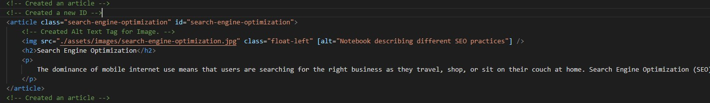

# <header>Horiseon-Refractoring Homework</header>
  
 
 
 
<h2> Description </h2>
<ul>
<li>The Purpose of this project was to refractor the source code into Semantic HTML.</li>
<li>The Motivation is to rank higher on search results through optimizing the structure of the code.</li>
<li>By reducing unnessesary code and accurately curating the code, the client's website can reach their desired audience more readily.</li>
<li> I learned through this project, refining and cleaning code makes it easier to edit that code in the future for myself and/or for another co-worker.</li>
</ul>
 
 
 
<h2> Installation </h2>
https://github.com/ahmadkane93/Horiseon-Homework
 
 
 
<h2> Usage </h2>
Navigate through the landing page and observe the functionality of the page.
Right Click the HTML, and inspect the page.
You will notice the HTML was adjusted to "Semantic HTML" 
for the purpose of ranking higher through positive SEO practices.
 
 

 
 
 
<h2>License</h2>

MIT License

Copyright (c) [2021] [Ahmad Kane]

Permission is hereby granted, free of charge, to any person obtaining a copy
of this software and associated documentation files (the "Software"), to deal
in the Software without restriction, including without limitation the rights
to use, copy, modify, merge, publish, distribute, sublicense, and/or sell
copies of the Software, and to permit persons to whom the Software is
furnished to do so, subject to the following conditions:

The above copyright notice and this permission notice shall be included in all
copies or substantial portions of the Software.

THE SOFTWARE IS PROVIDED "AS IS", WITHOUT WARRANTY OF ANY KIND, EXPRESS OR
IMPLIED, INCLUDING BUT NOT LIMITED TO THE WARRANTIES OF MERCHANTABILITY,
FITNESS FOR A PARTICULAR PURPOSE AND NONINFRINGEMENT. IN NO EVENT SHALL THE
AUTHORS OR COPYRIGHT HOLDERS BE LIABLE FOR ANY CLAIM, DAMAGES OR OTHER
LIABILITY, WHETHER IN AN ACTION OF CONTRACT, TORT OR OTHERWISE, ARISING FROM,
OUT OF OR IN CONNECTION WITH THE SOFTWARE OR THE USE OR OTHER DEALINGS IN THE
SOFTWARE.
 
 
 

<h2> Contacts </h2>
  Ahmad Kane- ahmadkane@mail.com
   
  https://github.com/ahmadkane93
  